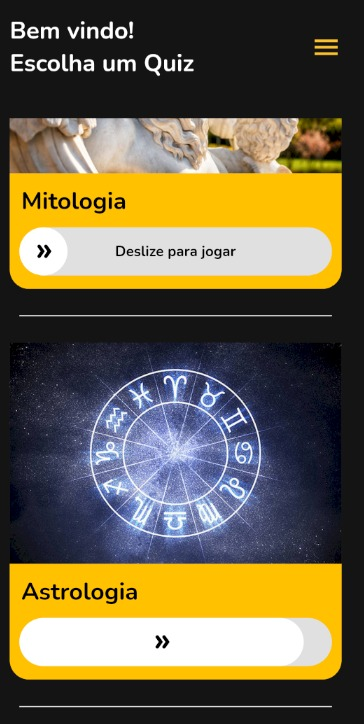

<h2 align="center">Fast Trivia📚<h2>
<p align="center">
    
</p>

   <h2>Topics 📋</h2>

  <p>
   
   - [Sobre 📖](#about-)
   - [Preview 📱](#preview-)
   - [Tecnologias Utilizadas 👨🏽‍💻](#---technologies-used----)
   - [Como usar 🤔](#how-to-use-)
   </p>

   <h2>Sobre 📖</h2>
   
   <p>
    O fast trivia consiste em um app que simula um jogo de questionáiros, onde você possui vários questionários de diversos assuntos e pode testar seus conhecimentos!
   </p>

---

   <h2>Preview 📱</h2><br>

   <p a>
    
    
   </p>
---

 <h2>
    Tecnologias Utilizadas 👨🏽‍💻
   </h2>
   
  * Flutter
  * Dart
  * Riverpod (Gerenciamento de Estado)
  * Json Rest Server (Criação do backend Mockado)
  * Dio (Consumo de Api) 
  * Rest API (https://dummyjson.com/)
  
---

   <h2>How to Use 🤔</h2>

```
- Clone e abra esse repositório

- Para instalar todas as dependências:
$ flutter pub get

- Rode o back end mockado :
$ cd backend
$ jrs run

- Connect your emulator or physical device

- Run the app:
$ flutter run
```

---

This project was developed by **[@Francisco Gabriel](https://www.linkedin.com/in/franciscossg/)**,
if it helped you, give ⭐, it will help me too 😉.

---

   <div>

[](https://www.linkedin.com/in/franciscossg/)

   </div>

